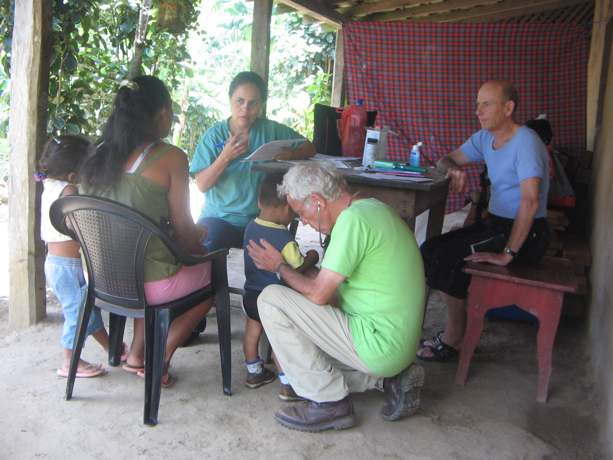

Dr. Egon Bantel (1947-2010) war ein deutscher Arzt. Er studierte Pädagogik und 
Humanmedizin und arbeitete als Dermatologe in verschiedenen Kliniken und in 
eigener Praxis. Seine Haltung und sein Handeln waren geprägt von der 
Überzeugung, dass Helfen und Teilen dem Menschen inhärente Verpflichtung sind.

Die Erfahrungen seines Lebens, in besonderem Maße auch die als Arzt auf den 
Philippinen (2007) und in Nicaragua (2008), führten ihn zu der Einsicht, dass 
Hilfe letztlich nur dann eine dauerhafte Chance hat, wenn sie Selbsthilfe 
möglich macht. Wie umfassend der Zugang zu Bildung ein Leben positiv verändern 
kann, hat er während seines eigenen Lebens auch an sich selbst erfahren.

<!--  -->

In dem Wunsch und der Hoffnung, etwas von ihm und seiner Haltung über seinen 
Tod hinaus wirken zu lassen, wurde 2017 diese Stiftung gegründet.

[1]: https://www.die-bibel.de/bibeln/online-bibeln/einheitsuebersetzung/bibeltext/bibel/text/lesen/stelle/50/250031/250046/
[2]: https://www.die-bibel.de/bibeln/online-bibeln/einheitsuebersetzung/bibeltext/bibel/text/lesen/stelle/50/250042/250043/
[3]: #stiftung
