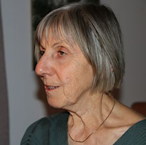
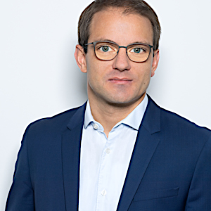
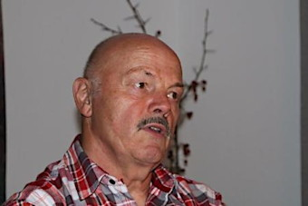
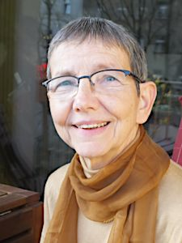
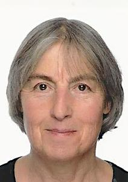

Der Vorstand der Dr.-Egon-Bantel-Stiftung:

### Dr. Ursula Bantel-Schaal
geb. 1943 in Haubersbronn (Baden-Württemberg)  
Biochemikerin, Dozentin i. R., Tutschfelden  
Stiftungsgründerin

### Dr. Tobias Piniek
geb. 1977 in Berlin (Ost)  
Lehrer, Wiesbaden  
Vorsitzender des Stiftungsrates

### Wolfgang Bantel
geb. 1952 in Oberurbach (Baden Württemberg)  
Fachkraft für Arbeitssicherheit, Dipl. Ing. (FH) i. R., Remstal

### Angelika Klapper
geb. 1951 in Erfurt  
Lehrerin i.R., Berlin

### Angelika Piniek
geb. 1952 in Berlin (Ost)  
Gemeindereferentin i.R., Berlin
